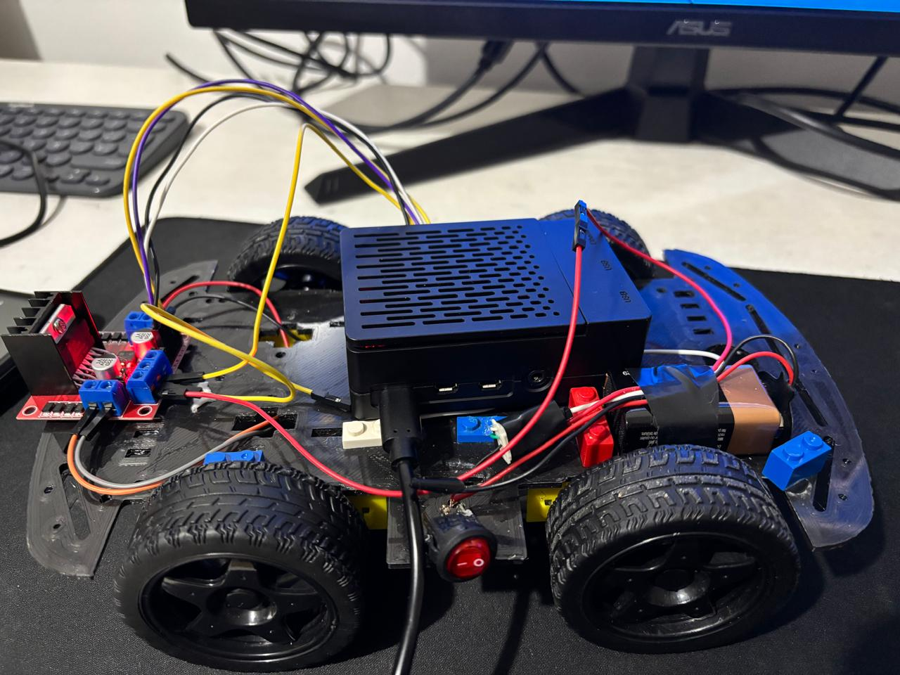
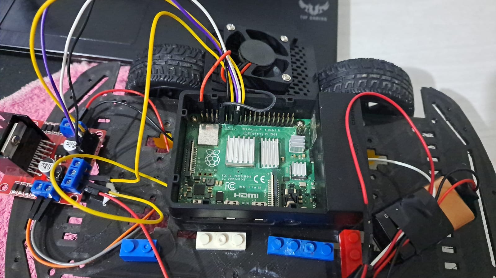

# Raspberrypi 4 Car With XBOX_controller

This is a project to drive a Raspberry Pi car with an Xbox controller. You can also use other controllers, but you'll need to use the library `evtest` to test all the inputs for your specific controller. NOTE: Make sure to use a virtual environment for this project! (◕‿◕)





# Libraries to Install

## RPi.GPIO
RPi.GPIO is installed for deafault in the raspverry but you can check
```bash
pip install RPi.GPIO

```
## evdev (Input Devices)
Install the `evdev` library for handling input devices:
```bash
pip install evdev
```
Or install evtest for testing inputs:
```bash
sudo apt-get install evtest
```

## All commands
To ensure everything is installed, run the following commands:
```bash
pip install RPi.GPIO
pip install evdev
sudo apt-get install evtest
```
## Testing the controller inputs
To check and see the inputs from your controller, use:
```bash
sudo evtest
```

